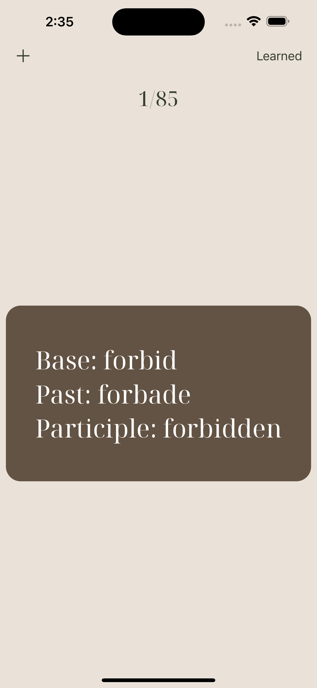
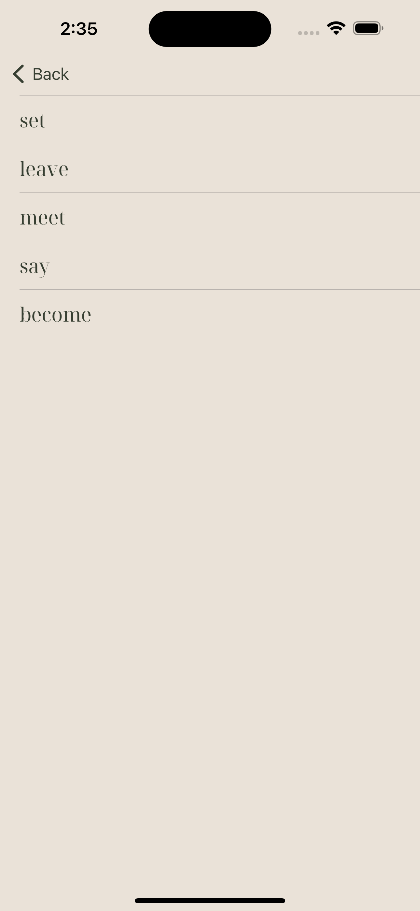
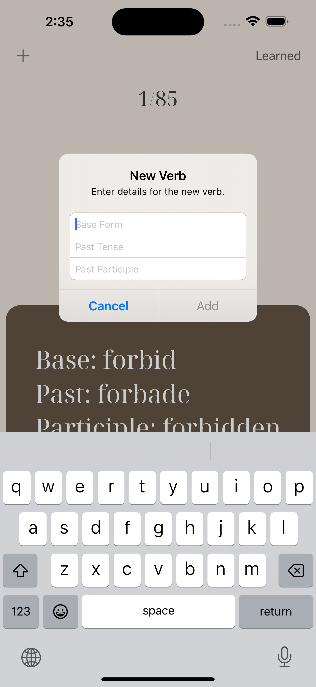

# English irregular verbs

This simple app designed as simple as possible. It can help to learn English irregular verbs.

## Screenshots

Here are some screenshots of my app in action:

<table>
  <tr>
    <td></td>
    <td></td>
    <td></td>
    <td></td>
  </tr>
</table>
